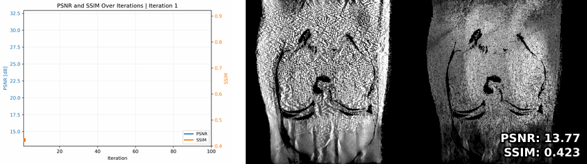
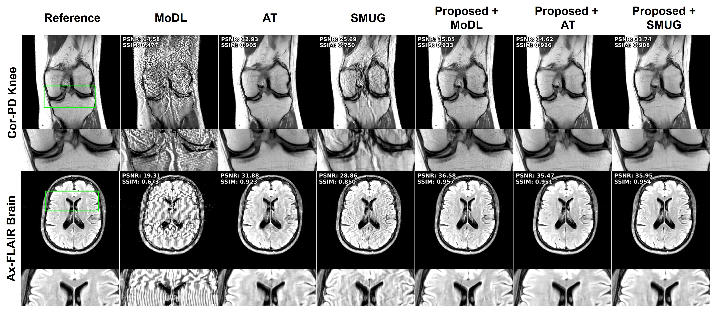

# [ICML'26] Training-Free Adversarial Mitigation for Computational MRI


<p>
  <a href="https://arxiv.org/abs/2501.01908">
    
  </a>
  <a href="https://icml.cc/virtual/2026/poster/64452">
    
  </a>
</p>

This repository provides the official implementation of our proposed cyclic mitigation strategy for adversarially robust computational MRI. 



## Abstract

Training-free adversarial mitigation is an inference-time defense method for improving the robustness of deep learning MRI reconstruction models without retraining.

The method treats the attacked measurement as an input to be corrected at test time by minimizing a cyclic measurement-consistency objective within a small neighborhood of the corrupted input. This allows the reconstruction to move away from adversarial perturbations while preserving consistency with the acquired k-space data.

Large-scale experiments show that the proposed method substantially reduces adversarial artifacts across datasets, attack types, attack strengths, and reconstruction networks. This repository currently includes the image-domain attack demo, with additional code to be added later.

<p align="center">
  
</p>

## Quick Start
Note: This code was tested with `torch==2.2.1+cu121`. 

## Installation

**Note:** This code was tested with `torch==2.2.1+cu121`.

### 1. Clone this repository

```bash
git clone https://github.com/MahdiSaberii/CycMit-MRI.git
cd CycMit-MRI
```

### 2. Create and activate conda environment

```bash
conda create -n cycmit_mri python=3.10 -y
conda activate cycmit_mri
```

### 3. Install PyTorch

```bash
pip install torch==2.2.1+cu121 --index-url https://download.pytorch.org/whl/cu121
```

### 4. Install remaining requirements

```bash
pip install -r requirements.txt
```

## Repository Structure

The pretrained checkpoint is provided in the `BestModel/` folder. A sample MRI dataset and the required sampling masks are provided in the `data/` folder.

```text
CycMit-MRI/
│
├── BestModel/
│   └── checkpoint.pth
│
├── data/
│   ├── kneePD.mat
│   ├── omega_mask.mat
│   ├── delta1.mat
│   ├── delta2.mat
│   └── delta3.mat
│
├── src/
│   ├── DF.py
│   ├── ResNet.py
│   ├── unrolled_network.py
│   └── Utils.py
│
├── Config.yaml
├── mitigation.py
├── DataLoader.py
└── requirements.txt
```

`BestModel/checkpoint.pth` contains the pretrained reconstruction network used in the demo. The `data/` folder contains one sample case, `kneePD.mat`, along with the required masks used for the image-domain attack and cyclic mitigation demo.


## 📝 BibTeX

```bibtex
@article{saberi2025training,
  title={Training-Free Defense Against Adversarial Attacks in Deep Learning MRI Reconstruction},
  author={Saberi, Mahdi and Zhang, Chi and Ak{\c{c}}akaya, Mehmet},
  journal={arXiv preprint arXiv:2501.01908},
  year={2025}
}
```
